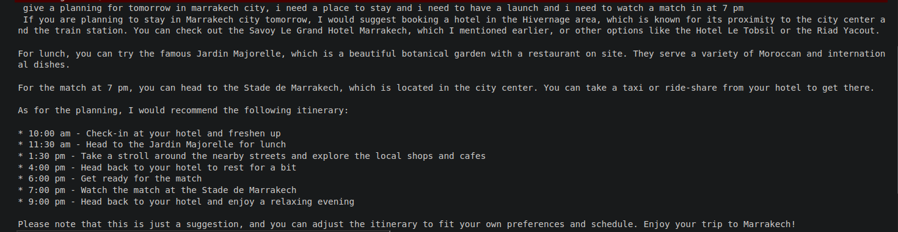
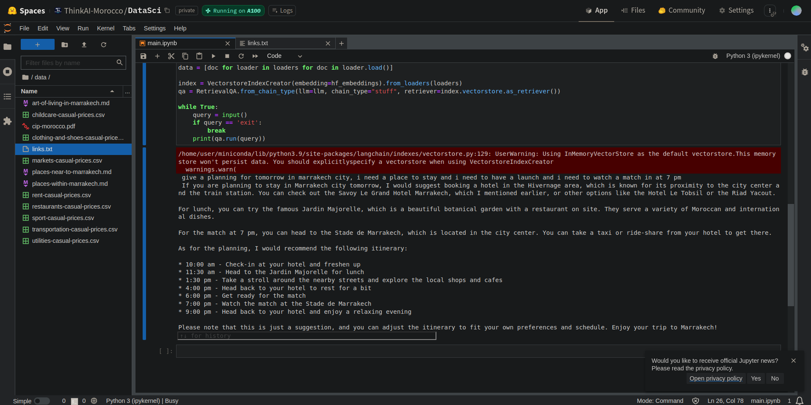

# Matssyedch

This project is an AI-powered travel assistant that can answer questions related to Marrakech, Morocco, based on a set of documents provided. It utilizes the Hugging Face Transformers library and the LangChain framework to create an embeddings-based vector index and a retrieval-based question-answering system.

# Example 
 input :  
 ```
give a planning for tomorrow in marrakech city, i need a place to stay and i need to have a launch and i need to watch a match in at 7 pm
 ```






output : 

```
give a planning for tomorrow in marrakech city, i need a place to stay and i need to have a launch and i need to watch a match in at 7 pm

If you are planning to stay in Marrakech city tomorrow, I would suggest booking a hotel in the Hivernage area, which is known for its proximity to the city center and the train station. You can check out the Savoy Le Grand Hotel Marrakech, which I mentioned earlier, or other options like the Hotel Le Tobsil or the Riad Yacout.

For lunch, you can try the famous Jardin Majorelle, which is a beautiful botanical garden with a restaurant on site. They serve a variety of Moroccan and international dishes.

For the match at 7 pm, you can head to the Stade de Marrakech, which is located in the city center. You can take a taxi or ride-share from your hotel to get there.

As for the planning, I would recommend the following itinerary:

* 10:00 am - Check-in at your hotel and freshen up
* 11:30 am - Head to the Jardin Majorelle for lunch
* 1:30 pm - Take a stroll around the nearby streets and explore the local shops and cafes
* 4:00 pm - Head back to your hotel to rest for a bit
* 6:00 pm - Get ready for the match
* 7:00 pm - Watch the match at the Stade de Marrakech
* 9:00 pm - Head back to your hotel and enjoy a relaxing evening

Please note that this is just a suggestion, and you can adjust the itinerary to fit your own preferences and schedule. Enjoy your trip to Marrakech!
```
# overview: 

GenAI-Powered Personalized Itinerary Application for Morocco

This project aims to create a GenAI-powered application that provides personalized daily plans for visitors attending major sporting events in Morocco. The application blends sporting event schedules with cultural experiences, tailoring itineraries based on user preferences and interests to enhance the overall visitor experience and promote Moroccan culture.

Personalized Daily Itineraries: The application generates customized daily itineraries that seamlessly combine sporting event schedules with curated cultural experiences, such as visits to historic sites, local festivals, and vibrant markets.

Curated Cultural Experiences: Leveraging advanced language models and contextual data retrieval, the application recommends authentic local attractions, restaurants, and activities based on user preferences and real-time context.


Travel Planning and Booking: The application assists users with travel planning, including transportation, accommodation, and event ticketing, integrating with various travel and booking platforms.


Real-time Updates and Notifications: The application provides real-time updates on event schedule changes, weather updates, and travel advisories, as well as personalized notifications based on user preferences.


User Reviews and Ratings: Users can rate and review their experiences, allowing the application to incorporate user feedback for continuous improvement.

# Benefits:

* Benefits to Morocco:

    - Promoting culture & heritage.
        
    - Boost tourism, and economy.

* Benefits to Moroccan: 

    - Showcasing local culture & tradition.

    - Employement opportunity.

* Benefits to tourists:

    - well-enriched and personalized experience

    - Guided itineraries

    - Reduced risk of being scammed

    - Access to authentic local experience

    - Time & hassle savings

# Services:

- Personalized Daily itineraries

- Reconnabdations && Suggesting

- Real-time updates.

- Travel planing & booking


# Technologies Used

Retrieval Augmented Generation (RAG): RAG is used for training the language model by providing additional context from relevant data sources, enabling better-informed responses.
Hugging Face: The project leverages the Hugging Face library for working with pre-trained language models and implementing the RAG approach.
langchain_huggingface: This library integrates LangChain with Hugging Face models, simplifying the process of setting up a pipeline with the model.
Llama3 (Language Model with Memory, Attention, and Reflection): Llama3 is used to incorporate conversation history and user preferences into the language model's responses.
Vector Database: A vector database is employed for efficient data storage and retrieval, providing the necessary context for generating personalized itineraries.
JSON API: A JSON file is used to provide relevant data, such as menus, prices, and other information related to Marrakech and its cultural attractions.

## Prerequisites

Before running the project, ensure that you have the following dependencies installed:

- Python 3.x
- pip (Python package installer)

## Installation

1. Clone the repository:


2. Navigate to the project directory:


3. Install the required Python packages:

```
pip install -r requirements.txt
```

4. Set the Hugging Face API token as an environment variable:

```
export HUGGINGFACEHUB_API_TOKEN=your_hugging_face_api_token
```

Replace `your_hugging_face_api_token` with your actual Hugging Face API token.

## Acknowledgments

- [Hugging Face Transformers](https://huggingface.co/transformers/)
- [LangChain](https://github.com/hwchase17/langchain)
- [FAISS](https://github.com/facebookresearch/faiss)
